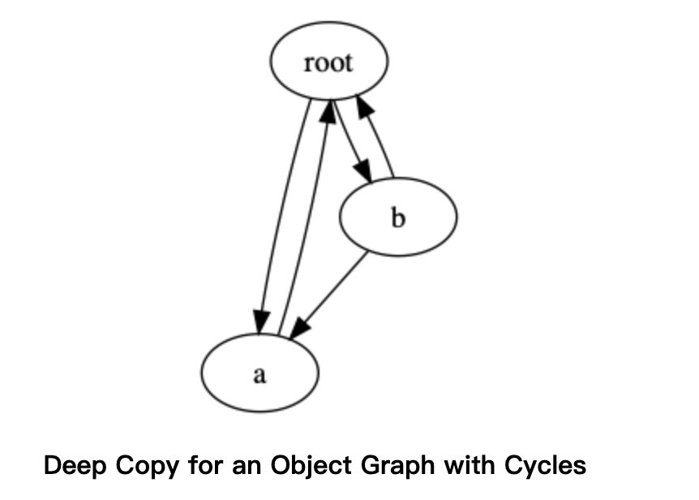

copy模块，提供了两个方法copy和deepcopy，用来复制已经存在的对象。

### 浅复制
copy()方法可以进行浅复制，创建一个新的容器填充对原始对象内容的引用。对于list对象，当进行浅复制的时候，会创建一个新的list，将原始对象中的元素添加到其中。

```
import copy

class MyClass:

    def __init__(self, name):
        self.name = name

    def __eq__(self, other):
        return self.name == other.name

    def __gt__(self, other):
        return self.name > other.name

def shallow_copy():
    a = MyClass('a')
    cur_list = [a]
    dup_list = copy.copy(cur_list)
    print ('cur_list:', cur_list)
    print ('dup_list:', dup_list)
    print ('cur_list is dup_list:', cur_list is dup_list)
    print ('cur_list == dup_list:', cur_list == dup_list)
    print ('cur_list[0] is dup_list[0]:', cur_list[0] is dup_list[0])
    print ('cur_list == dup_list:', cur_list[0] == dup_list[0])
```
上例中，由于是浅复制，MyClass实例并没有复制，因此在复制list中的引用和原始列表中的引用是一样的。

### 深复制
deepcopy()方法可以进行深复制，创建一个新的容器填充原始对象内容的副本。对于list对象，当进行深复制的时候，会创建一个新的list，并原始对象中的元素的副本添加到其中。

```
def deep_copy():
    a = MyClass('a')
    cur_list = [a]
    dup_list = copy.deepcopy(cur_list)
    print ('cur_list:', cur_list)
    print ('dup_list:', dup_list)
    print ('cur_list is dup_list:', cur_list is dup_list)
    print ('cur_list == dup_list:', cur_list == dup_list)
    print ('cur_list[0] is dup_list[0]:', cur_list[0] is dup_list[0])
    print ('cur_list == dup_list:', cur_list[0] == dup_list[0])
```

### 自定义复制行为

可以使用特殊方法 \_\_copy\_\_ 和 \_\_deepcopy\_\_ 来控制复制行为。

\_\_copy\_\_()方法不需要传参数，返回对象的浅复制。

\_\_deepcopy\_\_()方法需要传入memo的dict，返回对象的深复制。下面演示这两个方法的使用

```
class MyClass:

    def __init__(self, name):
        self.name = name

    def __eq__(self, other):
        return self.name == other.name

    def __gt__(self, other):
        return self.name > other.name

    def __copy__(self):
        print ('__copy__()')
        return MyClass(copy.copy(self.name))

    def __deepcopy__(self, memo):
        print ('__deepcopy__({})'.format(memo))
        return MyClass(copy.deepcopy(self.name, memo))
        
def customizing_copy():
    a = MyClass('a')
    sa = copy.copy(a)
    da = copy.deepcopy(a)
    print (a, sa, da)
```


### 深复制中的递归


为了避免复制递归数据结构的问题，deepcopy（）使用字典跟踪已复制的对象。该字典被传递给了\_\_deepcopy\_\_方法，因此可以进行检查。

下一个示例演示了互连的数据结构（如有向图）如何通过实现一个deepcopy方法来帮助防止递归。




```
class Graph:

    def __init__(self, name, connections):
        self.name = name
        self.connections = connections

    def add_connection(self, other):
        self.connections.append(other)

    def __repr__(self):
        return 'Graph(name={}, id={})'.format(
            self.name, id(self))

    def __deepcopy__(self, memo):
        print('\nCalling __deepcopy__ for {!r}'.format(self))
        if self in memo:
            existing = memo.get(self)
            print('  Already copied to {!r}'.format(existing))
            return existing
        print('  Memo dictionary:')
        if memo:
            for k, v in memo.items():
                print('    {}: {}'.format(k, v))
        else:
            print('    (empty)')
        dup = Graph(copy.deepcopy(self.name, memo), [])
        print('  Copying to new object {}'.format(dup))
        memo[self] = dup
        for c in self.connections:
            print ('----{}----{}'.format(self.name, c))
            dup.add_connection(copy.deepcopy(c, memo))
        return dup

def recursion_deepcopy():
    root = Graph('root', [])
    a = Graph('a', [root])
    b = Graph('b', [a, root])
    root.add_connection(a)
    root.add_connection(b)
    dup = copy.deepcopy(root)
```